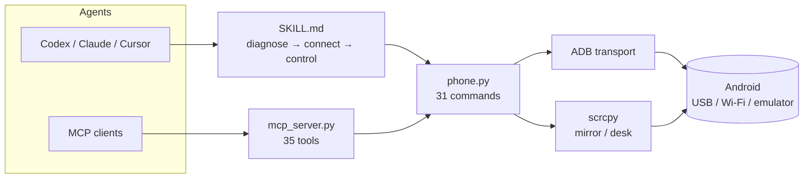
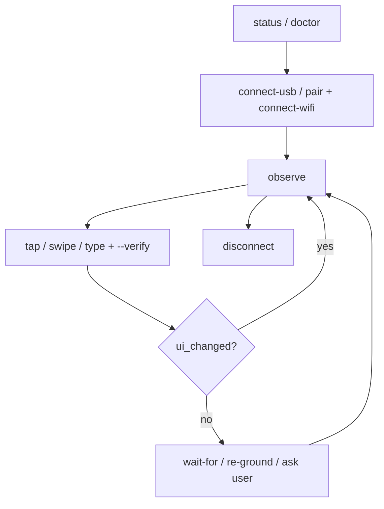

# Smartphone Use — Android Computer Use via ADB

[](https://skills.sh/TheusHen/smartphone-use)


Connect an Android phone/tablet or emulator to your PC over **USB or Wi-Fi**,
mirror it with **scrcpy**, and let an AI agent operate any app, chat, window,
or system screen through screenshots + UI dumps. Android-first and stable;
iOS is explicitly out of scope for now (see
`skills/smartphone-use/references/ios-future.md`).

Skills follow the [Agent Skills](https://agentskills.io/) format and install
with the [skills.sh](https://skills.sh) CLI.





- [Available Skills](#available-skills)
- [Installation](#installation)
- [60-second demo](#60-second-demo)
- [Why not just scrcpy / Appium?](#why-not-just-scrcpy--appium)
- [Requirements](#requirements)
- [Layout](#layout)
- [Install from source](#install-from-source-one-command)
- [Agent loop](#use-agent-loop)
- [CLI quick reference](#cli-quick-reference)
- [MCP server](#mcp-server-any-mcp-agent-can-drive-the-phone)
- [Grounding](#grounding-when-xml-is-blind)
- [Safety](#safety)

## Available Skills

### smartphone-use

Connect, mirror, and operate Android devices from your PC: USB/Wi-Fi setup
with guided diagnostics, screen mirroring via scrcpy, semantic tap/type/
swipe automation, notifications, clipboard, files, screen recording, virtual
displays, deterministic recipes, vision grounding, and an MCP server.

**Use when:**

- Connecting a phone to a PC (USB debugging, wireless ADB pairing)
- Mirroring or remote-controlling an Android screen
- Automating any Android app, chat, window, or system screen
- Reading what's on a phone screen (screenshot, UI dump, notifications)
- Diagnosing `adb` connection problems (`unauthorized`, `offline`, drivers)
- Driving phones from MCP-compatible agents (Claude Code, Codex, Cursor)

## Installation

```sh
npx skills add TheusHen/smartphone-use
```

> Skills are automatically available once installed. Page:
> https://skills.sh/TheusHen/smartphone-use
>
> **Compatibility note:** Eve and PromptScript don't support *global*
> installs — install at project level instead (verified working):
>
> ```sh
> npx skills add TheusHen/smartphone-use -p -y -a eve
> npx skills add TheusHen/smartphone-use -p -y -a promptscript
> ```

## 60-second demo

```powershell
python skills/smartphone-use/scripts/phone.py doctor --fix
python skills/smartphone-use/scripts/phone.py setup --mode usb
python skills/smartphone-use/scripts/phone.py observe now.png --json
python skills/smartphone-use/scripts/phone.py tap --text "Settings" --verify --json
python skills/smartphone-use/scripts/phone.py wait-for --text "Settings" --timeout 15 --json
python skills/smartphone-use/scripts/phone.py disconnect
```

Every `--json` result carries `ts` + `elapsed_ms`; every error carries
`cause` + `action` + `retry: auto|user|no` — the agent always knows whether
to retry, ask you, or fix the request.

## Why not just scrcpy / Appium?

| | Smartphone Use | scrcpy alone | Appium | Pure-vision phone agents |
|---|---|---|---|---|
| Diagnose + guided setup | Yes (`status`, `doctor`, `setup`) | No (raw errors) | No | Partial |
| Semantic tap (no coordinates) | Yes (XML + VLM/OmniParser tiers) | No | Yes (heavy server) | Yes (GPU/API cost) |
| Verify each action | Yes (`--verify`, `wait-for`) | Manual | Test asserts | Implicit |
| Deterministic replay | Yes (recipes) | No | Scripts | No |
| Works offline, stdlib-only | Yes | Yes | No (Node/Java stack) | No (model calls) |
| Live mirror + virtual display | Yes (via scrcpy) | Yes | No | No |
| MCP tools for any agent | Yes (35 tools) | No | No | Rare |

## Requirements

- Windows 10/11 with PowerShell 7+, Python 3.9+
- An Android phone/tablet (USB debugging) or an emulator
- Phone + PC on the same Wi-Fi for wireless mode

## Layout

```
skills/smartphone-use/           # canonical skill (skills.sh layout)
  SKILL.md                       # agent instructions: diagnose → connect → control
  scripts/
    phone.py                     # the only CLI the agent needs (31 subcommands)
    mcp_server.py                # MCP stdio server: 35 tools, zero extra deps
    install-deps.ps1             # Windows dependency installer (adb + scrcpy + pillow)
  references/                    # deep dives, loaded on demand
    usb-setup.md / wifi-pairing.md / emulator.md / internet-tunnel.md
    uiautomator-vs-coords.md / troubleshooting.md / security.md
    device-power.md / autonomy.md / grounding.md / mcp.md / ios-future.md
  assets/
    checklist-connection.txt     # one-page handout for the user
    example-flows.md             # copy-paste walkthroughs
```

## Install from source (one command)

```powershell
# From the repo root: installs deps, links the skill for all agents, diagnoses
powershell -ExecutionPolicy Bypass -File install.ps1
```

What it does: runs `install-deps.ps1` (adb + scrcpy + Pillow via winget/pip),
links the skill into `.agents/skills/`, `.claude/skills/` and
`.cursor/skills/` (Codex, Claude Code, Cursor and any SKILL.md-compatible
agent), then runs `phone.py status`. Manual steps live in
`skills/smartphone-use/references/usb-setup.md`.

## Use (agent loop)

```
status → connect-usb | pair + connect-wifi → screenshot + dump →
tap / swipe / type / key / launch (verify each step visually) → disconnect
```

Examples live in `skills/smartphone-use/assets/example-flows.md`;
hand the user `skills/smartphone-use/assets/checklist-connection.txt`
on first setup.

## CLI quick reference

| Command | Purpose |
|---|---|
| `status --json` | Diagnose setup + list devices with cause codes |
| `setup [--mode]` | First-run wizard (guides, waits, proves) |
| `doctor [--fix]` | Host + server health, safe auto-repair |
| `diag [--out]` | Support bundle (status + eval + versions) |
| `connect-usb` | Connect over USB |
| `pair IP:PORT CODE` | Pair Wireless debugging (Android 11+) |
| `connect-wifi IP:PORT` | Connect over Wi-Fi LAN |
| `disconnect` | Disconnect + reset transport to USB |
| `screenshot OUT.png` | Capture screen (the agent's eyes) |
| `dump [--out ui.xml]` | UI hierarchy with text/bounds |
| `tap X Y` / `tap --text "..."` | Tap coordinates or element (opt `--provider xml\|vlm\|omniparser\|auto`) |
| `swipe X1 Y1 X2 Y2 [MS]` | Swipe/scroll |
| `key CODE` | Keyevent (3=HOME 4=BACK 26=POWER) |
| `type "text"` | Type ASCII into focused field |
| `launch PACKAGE` | Open app; `packages --filter` finds names |
| `observe OUT.png` | Bundled read: screenshot + elements + foreground app (1 call) |
| `wait-for` | Block until `--text`/`--package [--focused]`/`--change` (or timeout) |
| `notify [--filter]` | List notifications (read-only) |
| `clip get` / `clip set` | Device clipboard (helper app; else `--via type`/scrcpy) |
| `files pull\|push\|ls` | Move/list files |
| `record OUT.mp4` | Screen recording, 1–180 s, no audio |
| `desk PACKAGE` | App in separate virtual display (physical screen untouched) |
| `mirror [--otg]` | Live scrcpy window; OTG = HID control without debugging |
| `fleet` | Multi-device overview (model/Android/battery/transport) |
| `ground "query"` | Vision/semantic locate → pixels (no tap) |
| `recipe new\|check` / `run FILE` | Deterministic recipes (act→verify→resume) |
| `eval [--act]` | Self-test harness |
| `shell -- ARGS` | Raw adb shell escape hatch (auto-capped at `--max-chars`) |
| Global | Every command: `--json` (+`ts`/`elapsed_ms`; errors carry `retry: auto\|user\|no`), `--retries N` (repeat `auto` failures), `--dry-run` (preview mutating), `--log-dir` (JSONL transcript), `--verbose` (echo adb), `--max-chars` (default 8000) |

## MCP server (any MCP agent can drive the phone)

```powershell
# stdio, zero extra dependencies; shell tool gated by MCP_ALLOW_SHELL=1
python skills/smartphone-use/scripts/mcp_server.py
```

35 tools: status/setup/doctor/diag/screenshot/dump/observe/wait_for/tap/swipe/type/key/launch/packages/notify/
clip_get/clip_set/record/files_pull/files_push/files_ls/ground/fleet/desk/
mirror/run/recipe_new/recipe_check/eval/connect_usb/pair/connect_wifi/
disconnect/tunnel/shell. See `skills/smartphone-use/references/mcp.md`.

## Grounding (when XML is blind)

`tap --text`/`ground` default to instant offline XML; point
`VLM_GROUND_URL` at any OpenAI-compatible vision endpoint (UI-TARS, Qwen-VL…)
or `OMNIPARSER_URL` at a self-hosted parser for pixel-based grounding.
`screenshot --annotate` needs Pillow (installed by `install-deps.ps1`).
See `references/grounding.md`.

## Safety

- USB or same-LAN Wi-Fi only. **Never expose raw ADB port 5555 to the
  Internet** — remote access rides inside SSH or a mesh VPN.
- `disconnect` + turn debugging off when finished.
- The agent asks before installing apps, signing in, spending, or messaging.
